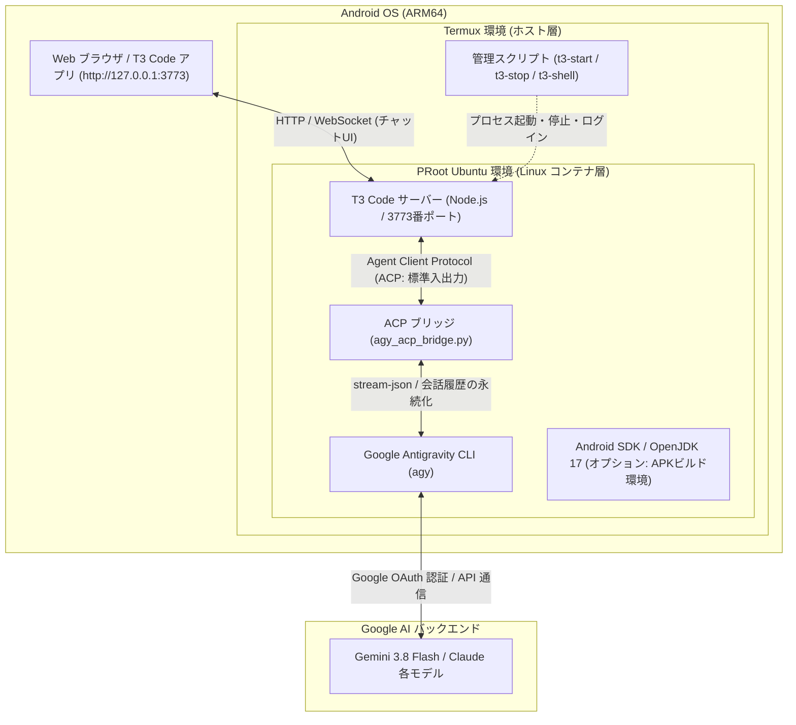

# Antigravity & T3 Code on Android (Termux)

Android 上の **Termux**（Google Play 版 / F-Droid 版）および **proot-distro (Ubuntu)** を利用し、[T3 Code](https://github.com/pingdotgg/t3code) と **Google Antigravity CLI (`agy`)** を連携させて、Android 端末単体で完全な自律型 AI コーディング環境をワンライナーで構築するためのスクリプト群です。

オプションで、ARM64 環境に最適化された **Android SDK (APK/AAB ビルド環境)** の自動構築もサポートします。

---

## 主な特徴

- 🚀 **ワンライナー導入**: Termux 上で 1 行のコマンドを実行するだけで Ubuntu 環境、Node.js、T3 Code、Antigravity CLI まで完全自動構築。
- 🤖 **公式 Antigravity CLI (`agy`) ネイティブ連携**:
  - Google 公式の Antigravity CLI (`linux_arm64`) を利用。Termux / PRoot Ubuntu 環境から **Google アカウント認証 (OAuth)** で本物の AI と直接対話可能。
  - API キーの発行や従量課金設定は不要。
- 🧠 **最新モデル対応**:
  - **Gemini 3.8 Flash**（デフォルト・超高速レスポンス）
  - **Claude Sonnet 4.6**（高精度コーディング）
  - **Claude Opus 4.6**（高度な推論）
  - Gemini 2.5 Pro / Flash
- ⚡ **自律エージェント機能（全ツール自動承認）**:
  - エージェント実行時に `--dangerously-skip-permissions` を自動適用。
  - ファイルの作成・編集、ディレクトリ探索、シェルコマンドの実行などを AI が自律的に完結。
- 💬 **マルチターン会話の完全永続化**:
  - T3 Code のスレッドごとのセッション ID と Antigravity CLI の会話履歴 (`--conversation`) を自動的にマッピング・永続化 (`~/.gemini/antigravity-acp/session_map.json`)。
  - スレッド内で会話が複数ターンに及んでも以前の文脈や指示を完全に保持。
- 🛡 **Android ARM64 最適化ブリッジ & リアルタイムストリーミング**:
  - Android 特有の仮想アドレス空間（39-bit VA）起因で公式 ACP サーバーバイナリが異常終了（Aborted）する問題を解消する軽量 ACP ブリッジ (`scripts/agy_acp_bridge.py`) を提供。
  - `stream-json` 連携により、応答テキストの逐次ストリーミングに加えてツール実行状況（Bash コマンド実行等）をリアルタイム可視化。
  - Gemini 3 系モデルでの `--effort medium` 自動付与や、モデル・セッションエラー時の自動フォールバック機構を内蔵。
- 🛠 **Android SDK ビルド環境（オプション）**:
  - ARM64 版 `aapt2` のパッチ適用済み。端末内での Gradle による APK ビルドが可能。
- 📱 **直感的な操作コマンド**:
  - `t3-start`、`t3-stop`、`t3-status`、`t3-shell` などの Termux コマンドを自動生成。

---

## 前提条件

1. **Android 端末** (ARM64 / aarch64 推奨)
2. **Termux** (Google Play 版 または F-Droid 版)
3. **空きストレージ容量**:
   - 基本構成 (Ubuntu + T3 Code + Antigravity): 約 2.5 GB 以上
   - Android SDK オプション追加時: 約 5 GB 以上

---

## インストール手順

### 1. Termux を起動してワンライナーを実行

Termux を開き、以下のコマンドを貼り付けて実行します。

```bash
pkg update -y && pkg install -y curl
curl -fsSL "https://raw.githubusercontent.com/aegisfleet/setting-up-antigravity-on-android/main/install.sh?v=$(date +%s)" | bash
```

> **対話プロンプトについて**:
> スクリプト実行中に「`Android SDK (APKビルド環境) もセットアップしますか？ [y/N]:`」と尋ねられます。
> Android アプリの端末内ビルドも行いたい場合は `y`、T3 Code とエージェントのみで十分な場合は `n`（Enter）を押してください。
> （環境変数 `INSTALL_ANDROID_SDK=1` を指定して非対話で実行することも可能です）

---

## 使い方 (3ステップ)

### ステップ 1: Antigravity の初回 Google 認証

Antigravity CLI (`agy`) の初回認証を行います。Termux で以下を実行します。

```bash
# 1. Ubuntu シェルに入る
t3-shell

# 2. agy を起動して Google アカウントでログイン
agy
```

1. コンソールに Google 認証用の URL が表示されます。
2. Android のブラウザでその URL を開き、Google アカウントでログイン・認証を許可します。
3. 表示された認証コードを Termux のプロンプトに貼り付けて Enter を押します。
4. 認証成功のメッセージが出たら、`exit` で Ubuntu シェルを抜けて Termux に戻ります。

```bash
exit
```

> ※ 認証情報は端末内に保存されるため、この手順は**初回のみ**で完了します。

---

### ステップ 2: T3 Code サーバーの起動

Termux のプロンプトで以下を実行します。

```bash
t3-start
```

バックグラウンドでサーバーが起動します。

---

### ステップ 3: ブラウザからアクセスして対話開始

端末の Web ブラウザ（Chrome 等）を開き、以下のアドレスにアクセスします。

👉 **`http://127.0.0.1:3773`**

（Google Play で配信されている Android 版「T3 Code」アプリからローカルサーバーに接続して利用することも可能です）

- チャット画面ですぐに質問やコーディング指示を送信できます。
- モデル選択メニューから **Gemini 3.8 Flash**、**Claude Sonnet 4.6**、**Claude Opus 4.6** などを自由に切り替えて利用できます。

---

## 便利な管理コマンド

セットアップ完了後、Termux ホスト側で以下のショートカットコマンドが利用可能です。

| コマンド | 説明 |
| :--- | :--- |
| `t3-start` | T3 Code サーバーをバックグラウンド起動 (`http://127.0.0.1:3773`) |
| `t3-stop` | T3 Code サーバーを停止 |
| `t3-status` | サーバーの稼働状態と直近のログを確認 |
| `t3-shell` | Ubuntu PRoot 環境の bash シェルに対話的にログイン |

---

## オプション: Android アプリのビルド（Android SDK）

オプションを有効化した場合、Ubuntu 内に以下の環境が整います。

- **OpenJDK 17**: `/usr/lib/jvm/java-17-openjdk-arm64`
- **Android SDK**: `/opt/android-sdk` (`platforms;android-34`, `build-tools;34.0.0`)
- **ARM64 aapt2 対策**:
  - `~/.gradle/gradle.properties` に以下が自動設定されます。
    ```properties
    android.aapt2FromMavenOverride=/usr/local/bin/aapt2
    ```

### ビルドの実行例

```bash
# Ubuntu 環境に入る
t3-shell

# プロジェクトディレクトリに移動
cd /path/to/your-android-project

# Gradle でデバッグ APK をビルド
./gradlew assembleDebug
```

---

## アーキテクチャとファイル構成

### システム階層構成図



### ファイル構成

```
setting-up-antigravity-on-android/
├── install.sh                  # Termux ホスト側エントリーポイント
└── scripts/
    ├── setup-ubuntu.sh         # Ubuntu PRoot 環境の初期構築
    ├── install-antigravity.sh  # Antigravity プロバイダ構成 & ブリッジ登録
    ├── agy_acp_bridge.py       # T3 Code ACP ↔ agy CLI Python ブリッジ (会話永続化/ストリーミング)
    ├── t3-server-manager.sh    # T3 Code バックグラウンドサーバー管理
    └── install-android-sdk.sh  # Android SDK (aapt2 ARM64対応) セットアップ
```

### ACP ブリッジ (`agy_acp_bridge.py`) の動作原理

T3 Code は標準入力/標準出力経由の Agent Client Protocol (ACP) を用いてエージェントと通信します。本リポジトリのブリッジは以下の役割を果たします:

1. **セッション永続化**: T3 Code の `sessionId` を Antigravity の `conversation_id` にマッピングし、`~/.gemini/antigravity-acp/session_map.json` に保存。2ターン目以降は `--conversation <ID>` を自動付与して過去の文脈を引き継ぎます。
2. **リアルタイムストリーミング**: `agy` を `--output-format stream-json` で駆動し、`text_delta` による思考・文章出力や、ツール実行通知（`⚙️ Tool: <name>`）をリアルタイムに T3 Code UI へ中継します。
3. **モデル & Effort 最適化**: Gemini 3.8 Flash 等で必要な `--effort medium` を自動指定し、未対応モデルやセッション欠落時には安全に自動リトライします。

---

## トラブルシューティング

### 1. バックグラウンドでサーバーが勝手に落ちる (Phantom Process Killer)
Android 12 以降では、バックグラウンドのプロセス数が制限（最大 32 プロセス）されています。
- **対策 1**: Termux の通知欄を開き、「**Acquire Wakelock**」をタップしてスリープ抑止を有効にしてください。
- **対策 2**: PC と ADB 接続できる場合、以下のコマンドで制限を解除できます。
  ```bash
  adb shell "/system/bin/device_config put activity_manager max_phantom_processes 2147483647"
  ```

### 2. ポート 3773 が既に使われている
```bash
t3-stop
```
を実行して一度プロセスをクリーンアップしてから、再度 `t3-start` を実行してください。

### 3. Antigravity の認証をやり直したい場合
認証トークンを更新したい場合やアカウントを切り替えたい場合は、Ubuntu 内でトークンファイルを削除して `agy` を再実行してください。
```bash
t3-shell
rm -f ~/.gemini/antigravity-cli/antigravity-oauth-token
agy
exit
```

---

## ライセンス

[MIT License](LICENSE)

