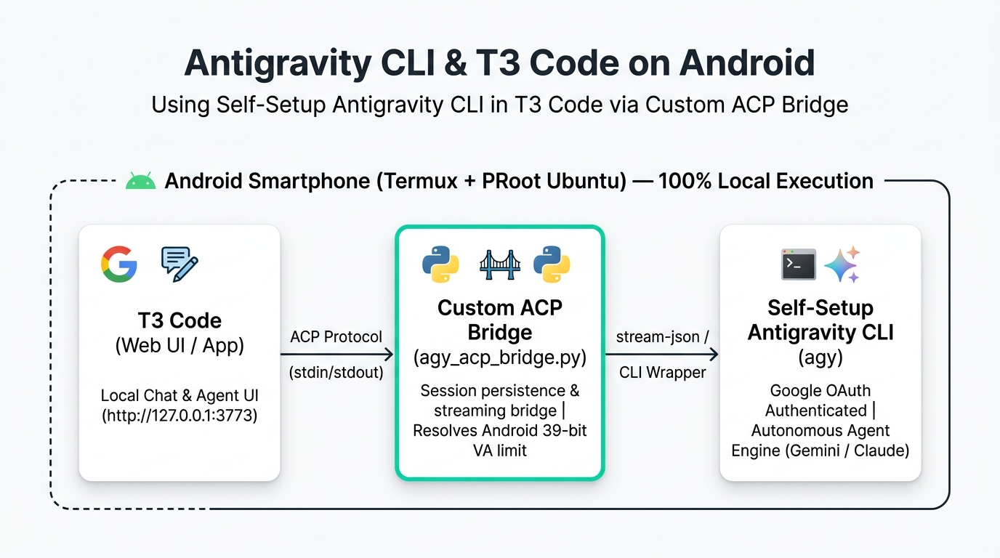
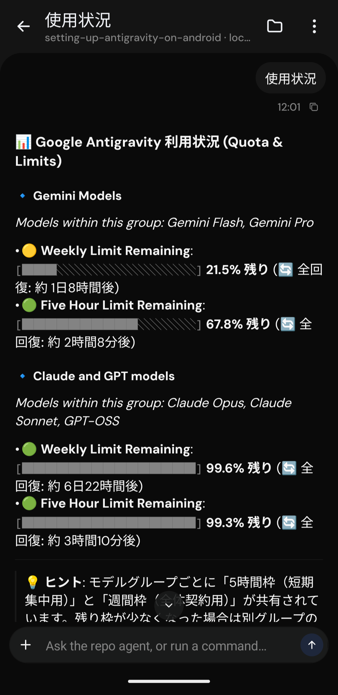
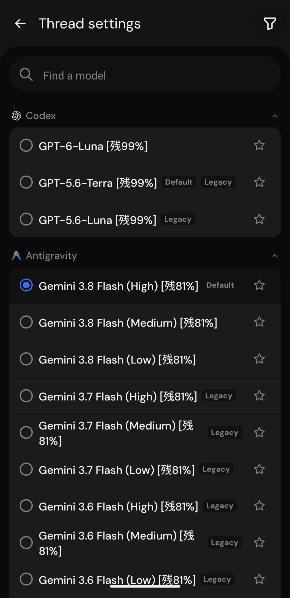
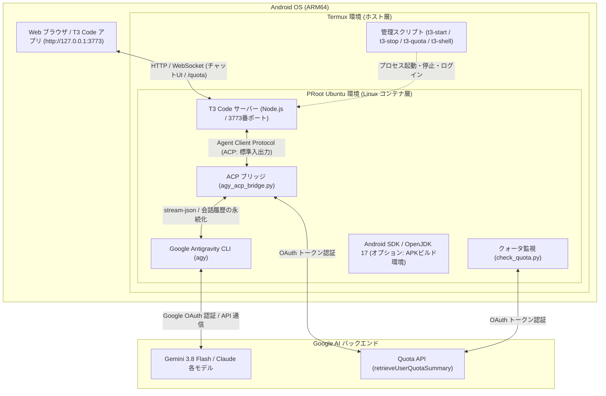

# Antigravity & T3 Code on Android (Termux)

<p align="center">
  
</p>

Android 上の **Termux**（Google Play 版 / GitHub Releases 版 / F-Droid 版）および **proot-distro (Ubuntu)** を利用し、[T3 Code](https://github.com/pingdotgg/t3code) と **Google Antigravity CLI (`agy`)** を連携させて、Android 端末単体で完全な自律型 AI コーディング環境をワンライナーで構築するためのスクリプト群です。

オプションで、ARM64 環境に最適化された **Android SDK (APK/AAB ビルド環境)** の自動構築もサポートします。

---

## 🎯 本リポジトリの目的

本リポジトリは、**T3 Code が標準で提供する Antigravity の仕組みを使用するのではなく、端末上で自前でセットアップした Antigravity CLI (`agy`) を T3 Code で使えるようにする** ことを目的に作成されています。

- **T3 Code 標準の仕組みとの違い**:
  T3 Code が標準で想定している Antigravity プロバイダは公式の ACP サーバーバイナリ（約 2GB）をダウンロードして動作させようとしますが、Android（ARM64）特有の仮想アドレス空間（39-bit VA）制約により、PRoot Ubuntu 環境では起動時にクラッシュ（`Aborted`）してしまいます。
- **本リポジトリのアプローチ**:
  環境内に自前でインストールし、Google アカウント認証を済ませた公式 Antigravity CLI (`agy`) をそのまま利用します。T3 Code と自前 CLI の間に軽量な Python 製 ACP ブリッジ（`scripts/agy_acp_bridge.py`）を配置することで、T3 Code のチャット UI から自前 Antigravity CLI を安定してフル活用できるようにしています。

---

## 主な特徴

- 🚀 **ワンライナー導入**: Termux 上で 1 行のコマンドを実行するだけで Ubuntu 環境、Node.js、T3 Code、Antigravity CLI まで完全自動構築。
- 🤖 **公式 Antigravity CLI (`agy`) ネイティブ連携**:
  - Google 公式の Antigravity CLI (`linux_arm64`) を利用。Termux / PRoot Ubuntu 環境から **Google アカウント認証 (OAuth)** で本物の AI と直接対話可能。
  - API キーの発行や従量課金設定は不要。
- 🧠 **最新モデル & 契約プラン動的同期**:
  - `agy models` によりログイン中アカウントの契約プランで利用可能なモデル（Gemini 3.8 Flash, Claude Sonnet 4.6, Claude Opus 4.6, GPT-OSS 等）を自動取得して T3 Code 画面に完全同期。
  - アカウント別の思考レベル（High / Medium / Low）の選択にもネイティブ対応。
- ⚡ **自律エージェント機能（全ツール自動承認）**:
  - エージェント実行時に `--dangerously-skip-permissions` を自動適用。
  - ファイルの作成・編集、ディレクトリ探索、シェルコマンドの実行などを AI が自律的に完結。
- 💬 **マルチターン会話の完全永続化**:
  - T3 Code のスレッドごとのセッション ID と Antigravity CLI の会話履歴 (`--conversation`) を自動的にマッピング・永続化 (`~/.gemini/antigravity-acp/session_map.json`)。
  - スレッド内で会話が複数ターンに及んでも以前の文脈や指示を完全に保持。
- 🛡 **Android ARM64 最適化ブリッジ & リアルタイムストリーミング**:
  - Android 特有の仮想アドレス空間（39-bit VA）起因で公式 ACP サーバーバイナリが異常終了（Aborted）する問題を解消する軽量 ACP ブリッジ (`scripts/agy_acp_bridge.py`) を提供。
  - `stream-json` 連携により、応答テキストの逐次ストリーミングに加えてツール実行状況（Bash コマンド実行等）をリアルタイム可視化。
  - Gemini 3 系モデルでの `--effort medium` 自動付与や、モデル・セッションエラー時の自動フォールバック機構を内蔵。
- 📊 **利用状況 (Quota / レート制限) のリアルタイム把握**:
  - **T3 Code チャット画面**: `/quota` や `/usage` に加え、**「使用量」「使用状況」「/使用量」「残量」などの日本語**で送信するだけでも、**推論トークンを消費することなく**（0 トークンで）即座に最新の残りパーセント（Gemini / Claude 各グループの 5時間枠・週間枠、全回復予定時刻）をグラフィカルに表示。※ OpenAI Codex 導入時は Codex のレート制限・残り枠も自動で併記されます。
  - **モデル選択メニュー**: ドロップダウンのモデル名横に現在の残り枠（例: `Gemini 3.8 Flash (High) [残72%]`, `GPT-6-Luna [残99%]`）を動的表示。切り替え前に残量を一目で確認可能。
  - **ターミナル連携**: Termux / Ubuntu 上で `t3-quota`（または日本語コマンド `使用量` / `使用状況`）を実行するだけでも即座に確認可能（Codex がインストールされていれば OpenAI Codex の利用状況も自動検出して一括表示）。
- 🎯 **スラッシュコマンド補完 & トークン消費ゼロのヘルプガイド**:
  - **チャット欄での `/` 入力サジェスト**: 入力欄で `/` を入力するだけで、利用可能なコマンド群（`/boost`, `/plan`, `/goal`, `/teamwork-preview`, `/grill-me`, `/quota`, `/help` 等）が日本語の説明付きでポップアップ表示。
  - **トークン消費ゼロの即答ヘルプ**: `/help`、`/ヘルプ`、または「ヘルプ」「コマンド一覧」と送信するだけで、**推論トークンを消費することなく**（0 秒即答）利用可能な全コマンド・機能ガイドをグラフィカルに表示。
- 🛠 **Android SDK ビルド環境（オプション）**:
  - ARM64 版 `aapt2` のパッチ適用済み。端末内での Gradle による APK ビルドが可能。
- 🤖 **OpenAI Codex CLI 連携（オプション）**:
  - 公式 Codex CLI (`@openai/codex`) の ARM64 静的バイナリと T3 Code の `codex app-server` 連携をワンタッチ構築。
  - ChatGPT アカウントの OAuth デバイス認証 (`codex login`) または OpenAI API キーに対応。
  - 軽量プロキシブリッジ (`scripts/codex_t3_bridge.py`) により、T3 Code のモデル選択画面で Codex モデル（GPT-6-Luna 等）の横にもリアルタイム残量（`[残99%]` 等）を自動付加。
- 🐙 **GitHub CLI (`gh`) 連携（オプション）**:
  - 公式最新 APT リポジトリから ARM64 向け `gh` を導入。OAuth デバイス認証（`gh auth login`）で Git 認証ヘルパーや Pull Request・Issue 操作を自動完結。
- 🔍 **Google EmbeddingGemma 2 & MCP 連携（オプション）**:
  - Google DeepMind の最新マルチモーダル埋め込みモデル（740M / 1.49GB）を端末内でローカル完全駆動。
  - 自然言語コード意味検索コマンド（`t3-search`）と、T3 Code / Antigravity CLI から呼び出せる **MCP (Model Context Protocol) サーバー**（`t3-embed-mcp`）を統合。
  - チャットエージェント（Gemini 3.8 Flash 等）がローカルコードベースを自律的に意味検索して関連実装をピンポイント探索。
  - OpenAI 互換 Embedding API サーバー（`/v1/embeddings`）機能も内蔵。
- 📱 **直感的な操作コマンド**:
  - `t3-start`、`t3-stop`、`t3-status`、`t3-quota`、`t3-shell`、`codex`、`gh`、`t3-search`、`t3-install-codex`、`t3-install-gh`、`t3-install-embedding` などの Termux コマンドを自動生成。

---

## 前提条件

1. **Android 端末** (ARM64 / aarch64):
   - **実機検証済み端末**: **Google Pixel 10 Pro Fold**
   - **対象となる ARM64 (aarch64) 端末の例**:
     - **Google Pixel**: Pixel 6 以降（Pixel 7, 8, 9, 10 シリーズ、Pixel Fold / Pixel 9 Pro Fold / Pixel 10 Pro Fold、Pixel Tablet 等）
     - **Samsung Galaxy**: Galaxy S21〜S25 シリーズ、Galaxy Z Fold / Flip シリーズ、Galaxy Tab S シリーズ等
     - **Sony Xperia**: Xperia 1 / 5 / 10 各世代等
     - **その他**: Snapdragon / Dimensity / Tensor 搭載の各社スマートフォン・タブレット全般（Xiaomi, OPPO, vivo, OnePlus, ASUS ROG Phone, Motorola 等）
     - ※ 近年発売された Android 端末の大部分（ほぼ 100%）は ARM64 (aarch64) アーキテクチャです。
2. **Termux**:
   - [Google Play 版](https://play.google.com/store/apps/details?id=com.termux)
   - [GitHub Releases 版](https://github.com/termux/termux-app/releases) / [F-Droid 版](https://f-droid.org/packages/com.termux/)
3. **空きストレージ容量**:
   - 基本構成 (Ubuntu + T3 Code + Antigravity): 約 2.5 GB 以上
   - Android SDK オプション追加時: 約 5 GB 以上

> 💡 **Termux の入手先による「できることの違い」について**:
> 
> 利用する Termux の入手先によって、Android 端末のハードウェア連携（Termux:API）で**できることが異なります**。用途に合わせて選択してください。
> 
> | 機能・用途 | Google Play 版 | GitHub Releases 版 / F-Droid 版 |
> | :--- | :---: | :---: |
> | **導入の手軽さ** | ⭐ **極めて手軽**（Play ストアからワンタップ） | APK の手動ダウンロードまたは F-Droid が必要 |
> | **T3 Code / Antigravity CLI 動作** | ✅ **完全対応** | ✅ **完全対応** |
> | **自律コーディング・Git・SDK ビルド** | ✅ **完全対応** | ✅ **完全対応** |
> | **端末情報取得（バッテリー・カメラ情報等）** | ✅ **対応** | ✅ **対応** |
> | **📸 カメラ撮影 (`termux-camera-photo`)** | ❌ **非対応**（Google Play 版は API 未実装） | ✅ **完全対応**（Termux:API 連携） |
> | **🎙 マイク録音・高度なデバイス制御** | ⚠️ **制限あり** | ✅ **完全対応**（Termux:API 連携） |
> 
> - **どちらを選ぶべきか？**:
>   - **Google Play 版（推奨・開発用途）**: AI による自律コーディング、ファイル作成・編集、Git 操作、Android アプリ（APK）のビルドなど、**通常の開発・エージェント環境として使う場合は Google Play 版で十分かつ最も手軽**です（本プロジェクトの基本動作検証済み）。
>   - **GitHub Releases 版 / F-Droid 版（ハードウェア連携用途）**: AI からカメラを起動して実世界を撮影・画像認識させたり、マイク録音など **Android 端末のハードウェア機能をフルに制御したい場合**はこちらを選択してください。※本体と [Termux:API](https://github.com/termux/termux-api/releases) アプリを**必ず同一の入手元（GitHub なら両方 GitHub、F-Droid なら両方 F-Droid）**からインストールする必要があります。


---

## インストール手順

### 1. Termux を起動してワンライナーを実行

Termux を開き、以下のコマンドを貼り付けて実行します。

```bash
pkg update -y && pkg install -y curl
curl -fsSL "https://raw.githubusercontent.com/aegisfleet/setting-up-antigravity-on-android/main/install.sh?v=$(date +%s)" | bash
```

> **対話プロンプトについて**:
> スクリプト実行中に以下の追加オプションをセットアップするか尋ねられます。
> 1. `Android SDK (APKビルド環境) もセットアップしますか？ [y/N]:`
> 2. `OpenAI Codex CLI (Codex プロバイダ連携) もセットアップしますか？ [y/N]:`
> 3. `GitHub CLI (gh / リポジトリ・PR連携) もセットアップしますか？ [y/N]:`
> 
> ここでスキップ（Enter）した場合でも、後からいつでも `t3-install-sdk`、`t3-install-codex`、`t3-install-gh` コマンドで個別にインストール可能です。
> （環境変数 `INSTALL_ANDROID_SDK=1`、`INSTALL_CODEX=1`、`INSTALL_GH=1` を指定して非対話実行も可能）

---

## 使い方 (3ステップ)

### ステップ 1: Antigravity の初回 Google 認証

Antigravity CLI (`agy`) の初回認証を行います。Termux で以下を実行します。

```bash
# 1. Ubuntu シェルに入る
t3-shell

# 2. agy を起動して Google アカウントでログイン
agy
```

1. コンソールに Google 認証用の URL が表示されます。
2. Android のブラウザでその URL を開き、Google アカウントでログイン・認証を許可します。
3. 表示された認証コードを Termux のプロンプトに貼り付けて Enter を押します。
4. 認証成功のメッセージが出たら、`exit` で Ubuntu シェルを抜けて Termux に戻ります。

```bash
exit
```

> ※ 認証情報は端末内に保存されるため、この手順は**初回のみ**で完了します。

---

### ステップ 2: T3 Code サーバーの起動

Termux のプロンプトで以下を実行します。

```bash
t3-start
```

バックグラウンドでサーバーが起動します。

---

### ステップ 3: ブラウザからアクセスして対話開始

端末の Web ブラウザ（Chrome 等）を開き、以下のアドレスにアクセスします。

👉 **`http://127.0.0.1:3773`**

（Google Play で配信されている Android 版「T3 Code」アプリからローカルサーバーに接続して利用することも可能です）

- チャット画面ですぐに質問やコーディング指示を送信できます。
- モデル選択メニューから **Gemini 3.8 Flash**、**Claude Sonnet 4.6**、**Claude Opus 4.6** などを自由に切り替えて利用できます。
- チャット欄で「**使用状況**」「**使用量**」または「**`/quota`**」と送信するだけで、**推論トークン消費ゼロ**（0 秒即答）で最新の利用状況（残りパーセント・全回復時刻）を確認できます。
- チャット入力欄で「**`/`**」を入力すると、`/boost`（深い推論・多角検証）、`/plan`（詳細計画立案）、`/goal`（自律完結）、`/teamwork-preview` などのコマンドが日本語説明付きでサジェストされます。
- チャット欄で「**`/help`**」または「**ヘルプ**」「**コマンド一覧**」と送信するだけで、**推論トークン消費ゼロ**で利用可能なコマンド一覧と機能ガイドを確認できます。

<p align="center">
  
  &nbsp;&nbsp;&nbsp;&nbsp;
  
</p>
<p align="center">
  <sub><b>左</b>: チャットでの利用状況確認（推論トークン消費ゼロ） &nbsp;／&nbsp; <b>右</b>: モデル選択メニューでのリアルタイム残量表示（Codex & Antigravity）</sub>
</p>

---

## 便利な管理コマンド

セットアップ完了後、Termux ホスト側で以下のショートカットコマンドが利用可能です。

| コマンド | 説明 |
| :--- | :--- |
| `t3-start` | T3 Code サーバーをバックグラウンド起動 (`http://127.0.0.1:3773`) |
| `t3-stop` | T3 Code サーバーを停止 |
| `t3-status` | サーバーの稼働状態と直近のログを確認 |
| `t3-quota` | Antigravity の利用状況（残りクォータ / レート制限）を確認（`使用量`, `使用状況` も利用可） |
| `t3-shell` | Ubuntu PRoot 環境の bash シェルに対話的にログイン |
| `codex` | OpenAI Codex CLI（Termux から直接 `codex login` 等を実行可能） |
| `gh` | GitHub CLI（Termux から直接 `gh auth login` 等を実行可能） |
| `t3-search` | Google EmbeddingGemma 2 によるローカル自然言語コード意味検索 |
| `t3-install-codex` | OpenAI Codex CLI をセットアップ（後からいつでも追加可能） |
| `t3-install-gh` | GitHub CLI をセットアップ（後からいつでも追加可能） |
| `t3-install-embedding` | Google EmbeddingGemma 2 (MCP連携) をセットアップ（後からいつでも追加可能） |
| `t3-install-sdk` | Android SDK (APKビルド環境) をセットアップ（後からいつでも追加可能） |

---

## オプション: OpenAI Codex CLI のセットアップ

OpenAI の公式コーディングエージェント **Codex CLI** を導入し、T3 Code から直接呼び出せるようにします。

### インストール方法（いつでも実行可能）

Termux または Ubuntu 内からワンコマンドでセットアップできます。

- **Termux から実行する場合**:
  ```bash
  t3-install-codex
  ```
- **Ubuntu PRoot 内から実行する場合**:
  ```bash
  bash /root/setting-up-antigravity-on-android/scripts/install-codex.sh
  ```

### アカウント認証（ログイン）

以下のいずれかの方法で認証します。

1. **ChatGPT アカウント（OAuth デバイスコード認証・推奨）**:
   Termux または Ubuntu シェルで `codex login --device-auth`（または `codex login`）を実行します。
   ```bash
   codex login --device-auth
   ```
   表示された 8 桁のコードと URL（`https://chatgpt.com/auth/device`）をスマホのブラウザで開いて認証を承認します。
2. **OpenAI API キー**:
   ```bash
   echo "sk-your-api-key" | codex login --with-api-key
   ```

認証完了後、`t3-stop && t3-start` でサーバーを再起動すると、T3 Code 画面のモデル選択に Codex モデル群が表示され、モデル名の横に現在の残量（`[残99%]` 等）がリアルタイムに表示されます。

---

## オプション: GitHub CLI (`gh`) のセットアップ

GitHub 公式の **GitHub CLI (`gh`)** を導入し、端末内からリポジトリの clone/push、Pull Request の作成・確認、Issue 管理などを円滑に行えるようにします。

### インストール方法（いつでも実行可能）

- **Termux から実行する場合**:
  ```bash
  t3-install-gh
  ```
- **Ubuntu PRoot 内から実行する場合**:
  ```bash
  bash /root/setting-up-antigravity-on-android/scripts/install-gh.sh
  ```

### アカウント認証（ログイン）

Termux または Ubuntu シェルで以下を実行します。

```bash
gh auth login
```

- **対話プロンプトでの選択例**:
  1. `What account do you want to log into?` → **GitHub.com**
  2. `What is your preferred protocol for Git operations?` → **HTTPS**
  3. `Authenticate Git with your GitHub credentials?` → **Yes**
  4. `How would you like to authenticate GitHub CLI?` → **Login with a web browser**
  5. 表示された 8 桁コードをブラウザ（https://github.com/login/device）に入力して承認します。

※ Personal Access Token をお持ちの場合は以下でも即座に認証可能です:
```bash
echo "ghp_your_token" | gh auth login --with-token
```

---

## オプション: Google EmbeddingGemma 2 (ローカルAI意味検索 & MCP連携)

Google DeepMind が公開した最新のマルチモーダル埋め込みモデル **[EmbeddingGemma 2](https://huggingface.co/google/embeddinggemma-2)**（740M パラメータ / 重み約 1.49 GB）を、Android (ARM64) 端末内で完全ローカル駆動させます。

自然言語によるコード探索（セマンティック検索）に加え、T3 Code 上の AI エージェント（Gemini 3.8 Flash や Claude）が自律的にコードを意味検索できる **MCP (Model Context Protocol) サーバー** として機能します。

> 💡 **動作実績（本環境実測）**:
> - **メモリ消費**: ピーク約 1.0 GB（Android 端末の空きメモリ内で安定動作、OOM クラッシュなし）
> - **推論速度**: 5 文のベクトル化が約 5.9 秒（1 文あたり約 1.2 秒、CPU 7 スレッド並列）
> - **精度**: 日本語の自然言語の問いに対して、関連するコード・ドキュメントを極めて高精度にコサイン類似度で順位付け可能。

### インストール方法（いつでも実行可能）

- **Termux から実行する場合**:
  ```bash
  t3-install-embedding
  ```
- **Ubuntu PRoot 内から実行する場合**:
  ```bash
  bash /root/setting-up-antigravity-on-android/scripts/install-embeddinggemma.sh
  ```

※ スクリプト実行時に Python 仮想環境 (`/opt/embedding-env`) の構築、PyTorch (CPU aarch64)、Transformers、SentenceTransformers の導入、モデル重み（約 1.49 GB）のキャッシュ、および Antigravity CLI への MCP サーバー自動登録がワンストップで完了します。

### 活用方法

#### 1. ターミナルから自然言語コード意味検索 (`t3-search`)
Termux や T3 Code の内蔵ターミナルから、プロジェクト内のコードやドキュメントを自然言語でセマンティック検索できます。

```bash
# カレントディレクトリ内のコードを意味検索
t3-search "ACP bridge implementation"

# ディレクトリと取得件数を指定
t3-search "ユーザー認証の仕組み" -p /root/setting-up-antigravity-on-android -k 3
```

#### 2. モデル選択メニューから「EmbeddingGemma 2」を選んでチャット開始
T3 Code のチャット画面右上のモデル選択ドロップダウンから、Gemini や Claude と同様に **`EmbeddingGemma 2 [ローカル / 意味検索]`** を事前に選択して新しいチャットを開始できます。

- **動作**:
  このモデルを選択したスレッドでは、チャット欄に自然言語メッセージ（例: `認証トークンのリフレッシュ処理`、`エラーハンドリング`）を送信するだけで、**推論トークン消費ゼロ**でプロジェクト内を自動ベクトル検索し、該当コードスニペットとファイル位置をチャット画面に直接返答します。
- スラッシュコマンド（`/search`）を打つ必要すらなく、通常の対話感覚でローカルコード検索専用スレッドとして活用できます。

#### 3. T3 Code / Antigravity & Codex AI エージェント連携 (MCP サーバー)
セットアップ時に `agy mcp add embedding /usr/local/bin/t3-embed-mcp` および `codex mcp add embedding -- /usr/local/bin/t3-embed-mcp` が自動実行され、Antigravity CLI および Codex CLI の両方で MCP サーバーとして有効化されます。

> 💡 **Provider 設定について**:
> EmbeddingGemma 2 は文章生成モデル（LLM）ではなくテキスト埋め込み（Embedding）特化モデルのため、独立した生成 Provider ではなく **Antigravity や Codex の AI エージェントが利用する MCP ツール** として動作します。チャットやコード生成を行う際は、Provider には通常通り「Antigravity」または「Codex」を選択してご利用ください。

T3 Code チャット画面でエージェント（Gemini 3.8 Flash、Claude、GPT-6 等）に対して以下のように依頼すると、エージェントが自律的に EmbeddingGemma 2 のツール (`semantic_code_search`) を呼び出してプロジェクト内を意味検索します:
- *「プロジェクト内からクォータ残量計算のロジックを探して」*
- *「認証処理を実装している箇所をセマンティック検索で見つけて」*

#### 4. OpenAI 互換 Embedding API サーバー (`t3-embed-server`)
標準的な `/v1/embeddings` エンドポイントを提供する軽量 HTTP サーバーです。他のエディタ拡張機能や RAG ツールからローカル Embedding モデルとして利用できます。

```bash
# ポート 8000 でバックグラウンド起動
t3-embed-server --port 8000 &

# API テスト
curl -X POST http://127.0.0.1:8000/v1/embeddings \
  -H "Content-Type: application/json" \
  -d '{"input": "def hello(): pass"}'
```

---

## オプション: Android アプリのビルド（Android SDK）

オプションを有効化した場合、Ubuntu 内に以下の環境が整います。

- **OpenJDK 17**: `/usr/lib/jvm/java-17-openjdk-arm64`
- **Android SDK**: `/opt/android-sdk` (`platforms;android-34`, `build-tools;34.0.0`)
- **ARM64 aapt2 対策**:
  - `~/.gradle/gradle.properties` に以下が自動設定されます。
    ```properties
    android.aapt2FromMavenOverride=/usr/local/bin/aapt2
    ```

### ビルドの実行例

```bash
# Ubuntu 環境に入る
t3-shell

# プロジェクトディレクトリに移動
cd /path/to/your-android-project

# Gradle でデバッグ APK をビルド
./gradlew assembleDebug
```

---

## アーキテクチャとファイル構成

### システム階層構成図



### ファイル構成

```
setting-up-antigravity-on-android/
├── install.sh                  # Termux ホスト側エントリーポイント
└── scripts/
    ├── setup-ubuntu.sh         # Ubuntu PRoot 環境の初期構築
    ├── install-antigravity.sh  # Antigravity プロバイダ構成 & ブリッジ登録
    ├── agy_acp_bridge.py       # T3 Code ACP ↔ agy CLI Python ブリッジ (会話永続化/ストリーミング/クォータ管理)
    ├── check_quota.py          # Antigravity & Codex 利用状況・レート制限チェッカー
    ├── t3-server-manager.sh    # T3 Code バックグラウンドサーバー管理
    ├── install-codex.sh        # OpenAI Codex CLI セットアップ & T3 Code 有効化
    ├── codex_t3_bridge.py      # T3 Code ↔ Codex CLI 透過プロキシブリッジ (モデル名への残量動的付加)
    ├── install-gh.sh           # GitHub CLI (gh) セットアップ & Termux 連携
    └── install-android-sdk.sh  # Android SDK (aapt2 ARM64対応) セットアップ
```

### ACP ブリッジ (`agy_acp_bridge.py`) の動作原理

T3 Code は標準入力/標準出力経由の Agent Client Protocol (ACP) を用いてエージェントと通信します。本リポジトリでは、T3 Code 組み込みの Antigravity 連携機構（公式 ACP サーバーバイナリ）の代わりに、端末上に自前でセットアップした Antigravity CLI (`agy`) を呼び出して中継するカスタム ACP ブリッジスクリプトを提供しています。このブリッジは以下の役割を果たします:

1. **セッション永続化**: T3 Code の `sessionId` を Antigravity の `conversation_id` にマッピングし、`~/.gemini/antigravity-acp/session_map.json` に保存。2ターン目以降は `--conversation <ID>` を自動付与して過去の文脈を引き継ぎます。
2. **リアルタイムストリーミング**: `agy` を `--output-format stream-json` で駆動し、`text_delta` による思考・文章出力や、ツール実行通知（`⚙️ Tool: <name>`）をリアルタイムに T3 Code UI へ中継します。
3. **プラン別モデル動的同期 & 最適化**: `agy models` から Google アカウント契約プランに応じた利用可能モデル一覧を動的取得・ローカルキャッシュ (`~/.gemini/antigravity-acp/models_cache.json`) し、T3 Code UI の選択肢に完全同期。旧モデル ID のエイリアス自動解決やモデル・セッションエラー時の自動フォールバック機構を内蔵。
4. **利用状況 (Quota) のゼロトークン即時回答 & メニュー連携**:
   - チャットで `/quota` や「利用状況」が送られた場合、AIモデルを起動することなく直接 Google Quota API から最新の利用残量を判定し、トークン消費ゼロで即座にグラフィカル表示。
   - モデル選択ドロップダウンの各モデル名に、現在のグループ残り枠（例: `[残72%]`）を動的付与。

---

## トラブルシューティング

### 1. バックグラウンドでサーバーが勝手に落ちる (Phantom Process Killer)
Android 12 以降では、バックグラウンドのプロセス数が制限（最大 32 プロセス）されています。
- **対策 1**: Termux の通知欄を開き、「**Acquire Wakelock**」をタップしてスリープ抑止を有効にしてください。
- **対策 2**: PC と ADB 接続できる場合、以下のコマンドで制限を解除できます。
  ```bash
  adb shell "/system/bin/device_config put activity_manager max_phantom_processes 2147483647"
  ```

### 2. ポート 3773 が既に使われている
```bash
t3-stop
```
を実行して一度プロセスをクリーンアップしてから、再度 `t3-start` を実行してください。

### 3. Antigravity の認証をやり直したい場合
認証トークンを更新したい場合やアカウントを切り替えたい場合は、Ubuntu 内でトークンファイルを削除して `agy` を再実行してください。
```bash
t3-shell
rm -f ~/.gemini/antigravity-cli/antigravity-oauth-token
agy
exit
```

---

## ライセンス

[MIT License](LICENSE)

